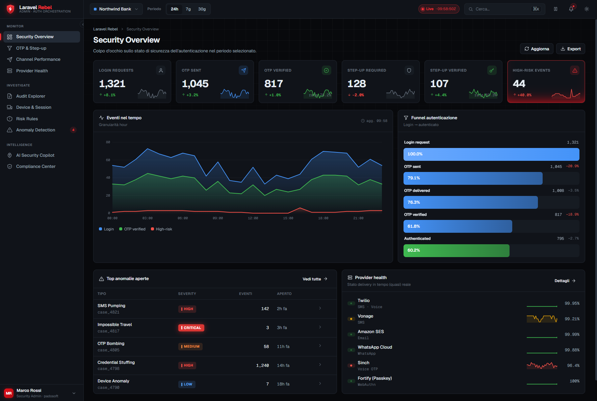
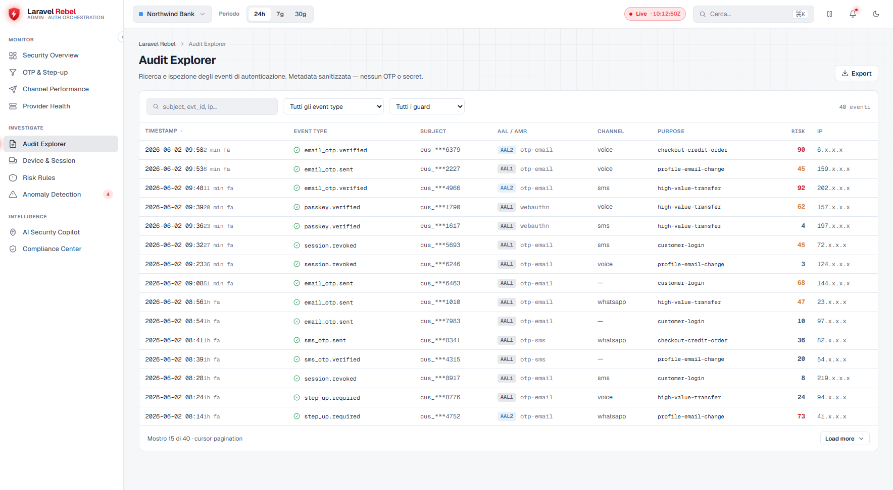
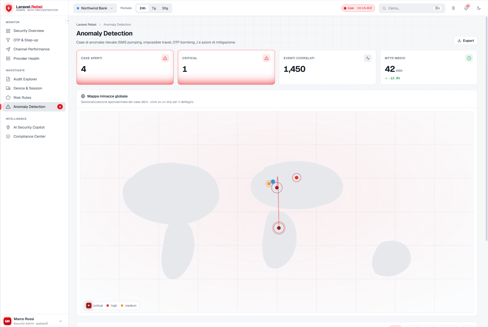
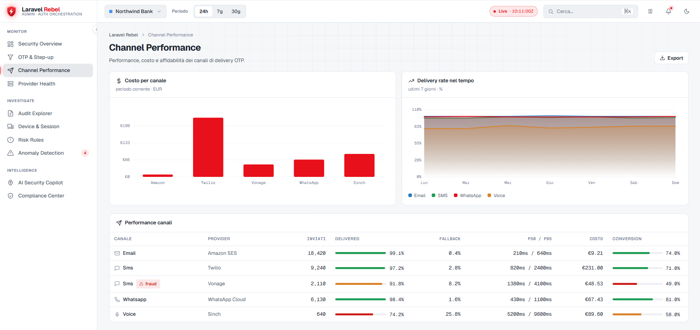
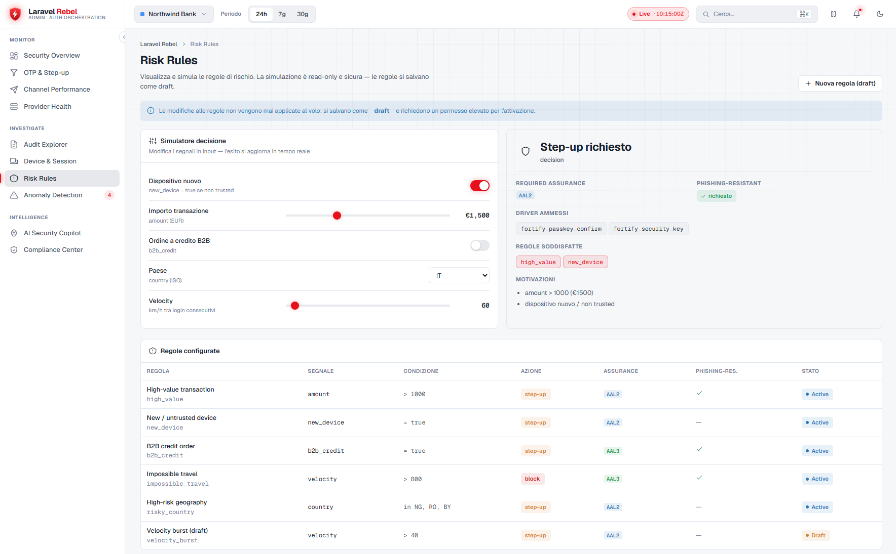
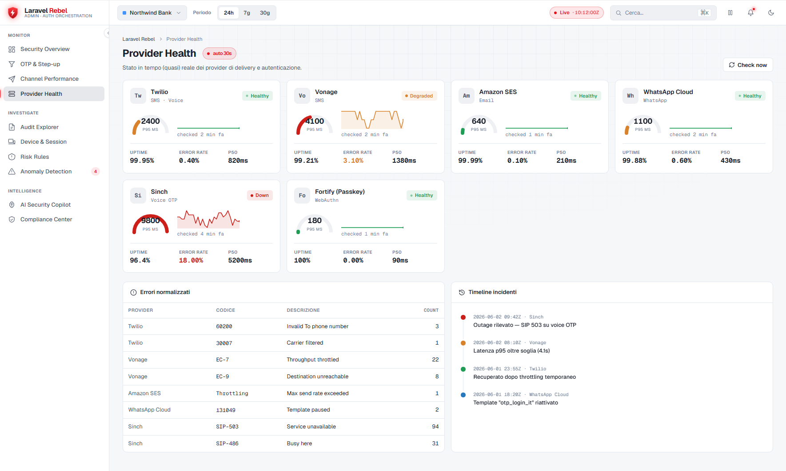
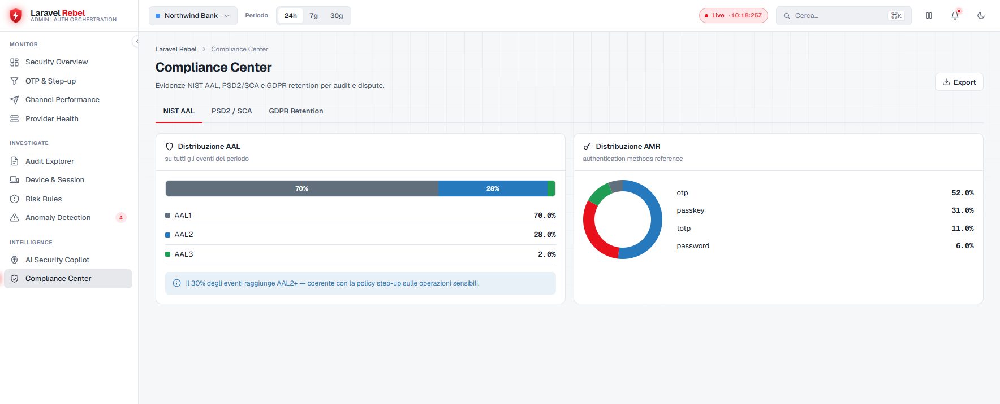
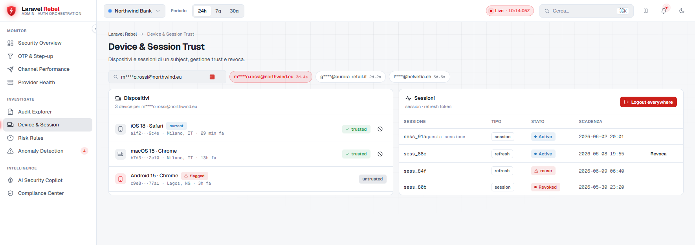
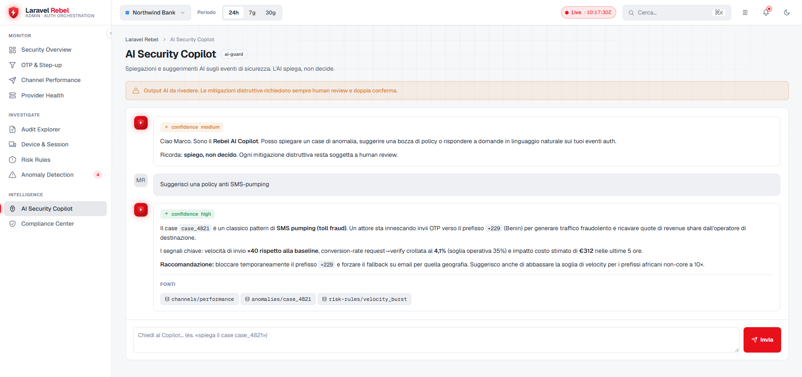

# Laravel Rebel — Web Admin Panel

> **A security-operations dashboard for your auth stack.** A clean Blade + vanilla-JS panel that hydrates entirely from the [Rebel Admin API](https://github.com/padosoft/laravel-rebel-admin-api): security overview, OTP/step-up funnels, channels, providers, audit explorer, devices, risk rules, anomalies, AI copilot and compliance — light/dark, tenant-aware, no JS framework required. Part of the `padosoft/laravel-rebel-*` suite.

<p align="center">
  
</p>

<p align="center">
  
  
  
  
  
  
</p>

---

## Table of contents

- [What it is](#what-it-is)
- [Screenshots](#screenshots)
- [Why this panel](#why-this-panel)
- [Rebel Admin Panel vs the alternatives](#rebel-admin-panel-vs-the-alternatives)
- [Installation](#installation)
- [Configuration](#configuration)
- [Sections](#sections)
- [Architecture](#architecture)
- [Security notes](#security-notes)
- [`.env.example`](#envexample)
- [Testing & License](#testing--license)

---

## What it is

The **web UI** of the Rebel control plane. It does not query your database directly — it
renders a skeleton and **hydrates each widget over the Admin API** (`AbortController` fetch,
explicit loading/empty/error states). It's deliberately dependency-light: **Blade + a single
vanilla-JS file + CSS variables**, no Alpine/Livewire/React/Vue required, Bootstrap-compatible.

Depends on [`padosoft/laravel-rebel-core`](https://github.com/padosoft/laravel-rebel-core)
and [`padosoft/laravel-rebel-admin-api`](https://github.com/padosoft/laravel-rebel-admin-api)
(the data source).

> **v0.1.0 status:** the full shell (10 sections, theming, tenant/period context, access
> gate) is in place; **Security Overview** and **Audit Explorer** hydrate from the live API,
> and the remaining sections render an "endpoint pending" state until their Admin API
> endpoints ship in upcoming releases.

---

## Screenshots

<p align="center">
  
</p>

| | |
|---|---|
|  |  |
|  |  |
|  |  |
|  |  |

---

## Why this panel

| ★ | What | In short |
|---|---|---|
| ★★★ | **API-driven, no direct DB queries** | The UI only talks to the Admin API — safe, cacheable, and decoupled from your schema. |
| ★★★ | **Dependency-light** | Blade + one vanilla-JS file + CSS variables. No JS framework, no heavy build step. |
| ★★★ | **Fail-closed access** | Anonymous → login; authenticated without the `rebel-admin` ability → 403. |
| ★★ | **Light/dark + tenant/period context** | Theme toggle and global context that re-hydrates every widget. |
| ★★ | **Explicit widget states** | Every widget draws loading (skeleton), empty, and error (with retry). |
| ★★ | **Accessible & responsive** | Focus-visible, `aria-live` regions, collapsible sidebar. |

---

## Rebel Admin Panel vs the alternatives

Building an auth-ops dashboard, compared:

| Capability | **Rebel Admin Panel** | Shopify | Generic admin (Nova/Filament) | Hand-rolled Blade dashboards |
|---|:---:|:---:|:---:|:---:|
| Purpose-built for the Rebel auth stack | ✅ | ❌ | ❌ | ➖ |
| API-driven (no direct DB coupling) | ✅ | ➖ | ❌ | ❌ |
| No JS framework / heavy build required | ✅ | ❌ | ❌ | ✅ |
| Self-hosted in your app (not hosted SaaS) | ✅ | ❌ | ✅ | ✅ |
| Themeable Blade over your own data | ✅ | ❌ | ➖ | ✅ |
| Hosted admin dashboard for staff | ✅ | ✅ | ✅ | ➖ |
| Built-in light/dark + tenant/period context | ✅ | ➖ | ➖ | ❌ |
| Explicit loading/empty/error per widget | ✅ | ➖ | ➖ | ❌ |
| Fail-closed access gate out of the box | ✅ | ➖ | ➖ | ❌ |
| Feature-flagged by installed Rebel packages | ✅ | ❌ | ❌ | ❌ |
| Ships with the security section designs | ✅ | ➖ | ❌ | ❌ |

> Legend: ✅ built-in · ➖ partial / DIY / hosted-only / not exposed to you · ❌ not available.
>
> Note: Shopify is a hosted, closed commerce platform — it ships its own admin dashboard but you can't self-host it, extend it, point it at your own data/tenants, or treat it as a library for your app.

---

## Installation

```bash
composer require padosoft/laravel-rebel-admin
php artisan vendor:publish --tag="rebel-admin-config"
php artisan vendor:publish --tag="rebel-admin-assets"   # publishes CSS/JS to public/vendor/laravel-rebel-admin
```

Grant access by defining the `rebel-admin` Gate (fail-closed by default):

```php
Gate::define('rebel-admin', fn ($user) => $user->is_admin === true);
```

Visit `/admin/rebel`.

---

## Configuration

File `config/rebel-admin.php`:

| Key | Default | What it does |
|---|---|---|
| `prefix` | `admin/rebel` | Where the panel is mounted. |
| `middleware` | `['web']` | Base middleware (session); `EnsurePanelAccess` is appended. |
| `guard` | `''` | Auth guard to require (`''` = default). |
| `ability` | `rebel-admin` | Gate ability to require (fail-closed). |
| `api_base` | `/rebel/admin/api/v1` | The Admin API base the JS hydrates from. |
| `login_redirect` | `/login` | Where anonymous visitors are sent. |

---

## Sections

Overview · OTP & Step-up Funnels · Channel Performance · Provider Health · Audit Explorer ·
Device & Session Trust · Risk Rules · Anomaly Detection · AI Security Copilot · Compliance
Center. See [`docs/admin-panel-template-spec.md`](docs/admin-panel-template-spec.md) for the
full per-section component + endpoint specification.

---

## Architecture

```
Browser ──GET /admin/rebel/{section}──► PanelController ──► Blade shell (skeleton + data-rebel-widget)
                                                                   │
   rebel-admin.js scans [data-rebel-widget], for each:            │
        AbortController fetch ──► {api_base}/<endpoint> (Admin API) ──► render (cards/table) | empty | error
```

Each section is one Blade page that renders the skeleton and declares its widgets via
`data-rebel-widget` + `data-endpoint`; `rebel-admin.js` hydrates them and re-fetches on
tenant/period changes.

---

## Security notes

- **No direct DB access from the UI** — only the Admin API, which is itself permission-gated
  and tenant-scoped.
- **Fail-closed**: the panel requires the `rebel-admin` ability by default.
- **No plaintext PII**: the Admin API only exposes HMAC'd identifiers; the panel renders text
  via `textContent` (no `innerHTML` interpolation of data).
- **Same-origin, CSRF-aware** requests.

---

## `.env.example`

```dotenv
REBEL_ADMIN_PREFIX=admin/rebel
REBEL_ADMIN_GUARD=
REBEL_ADMIN_ABILITY=rebel-admin
REBEL_ADMIN_API_BASE=/rebel/admin/api/v1
REBEL_ADMIN_LOGIN_REDIRECT=/login
```

---

## Testing & License

```bash
composer test      # Pest (access gate, shell rendering, sections, fail-closed)
composer phpstan   # static analysis, level max
composer pint      # code style
```

**License:** MIT — see [LICENSE](LICENSE). Part of the [`padosoft/laravel-rebel`](https://github.com/padosoft) suite.
